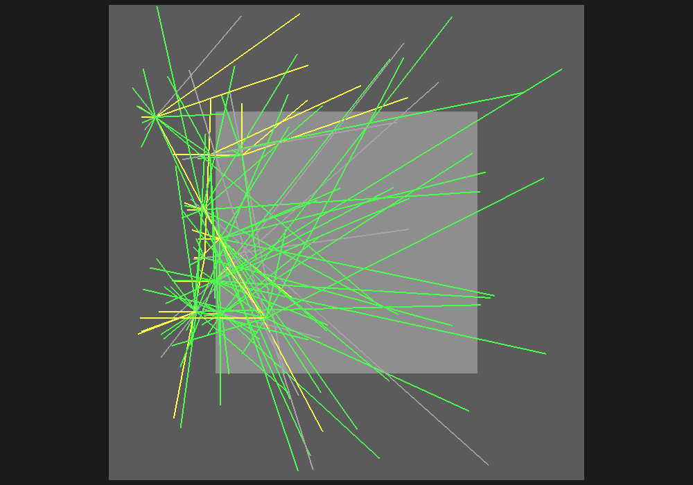

# Curso de transporte de partículas con Geant4

[](https://geant4.web.cern.ch/)
[](https://hub.docker.com/r/rmartinezmaple/geant4-particle-transport-course)
[](#qué-aprenderás)

Un curso práctico para **medir magnitudes físicas a partir de eventos Monte Carlo**, ajustar los resultados y compararlos después con modelos analíticos o referencias internas de Geant4.

No necesitas instalar Geant4, CMake ni Python. La imagen Docker ya contiene **Geant4 11.2.2**, compiladores, datasets, NumPy, SciPy y Matplotlib.

## Empieza en cinco minutos

Solo necesitas Git y Docker:

```bash
git clone https://github.com/rmartinezra/geant4-particle-transport-course.git
cd geant4-particle-transport-course

docker pull rmartinezmaple/geant4-particle-transport-course:11.2.2
docker compose run --rm geant4-course make test
```

`make test` compila los cinco módulos, genera cinco visualizaciones VRML, ejecuta simulaciones rápidas, analiza los datos y comprueba que las magnitudes físicas sean razonables.

Tu primera práctica completa:

```bash
docker compose run --rm geant4-course make run-ex1a FAST=1
docker compose run --rm geant4-course make analyze-ex1a
```

Al terminar encontrarás en `generated/`:

```text
generated/
├── data/           # eventos y barridos Monte Carlo
├── figures/        # gráficas producidas por el análisis
├── fits/           # parámetros e incertidumbres
├── logs/           # macros exactas, seeds y salida de Geant4
└── visualization/  # geometría + trayectorias en archivos .wrl
```

Todo queda guardado en tu computador aunque elimines el contenedor.

## Qué aprenderás

El curso contiene cuatro experimentos organizados en cinco módulos:

| Módulo | Pregunta física | Lo que medirás |
|---|---|---|
| **1A · Transmisión Compton** | ¿Cómo disminuye un haz gamma al atravesar aluminio? | `mu`, longitud libre `lambda` y sección eficaz `sigma` |
| **1B · Cinemática Compton** | ¿Cómo cambia la energía del fotón con el ángulo? | `m_e c²` mediante un ajuste lineal |
| **2 · Dispersión múltiple** | ¿Cómo escala la desviación de muones en hierro? | `sigma_core`, exponentes de espesor y momento |
| **3 · Pérdida de energía** | ¿Cuánta energía pierde un muón en agua? | pérdida primaria, depósito, secundarios y `dE/dx` |
| **4 · Fisión de U-235** | ¿Qué distancia recorre un neutrón antes de fisionar? | `lambda` y `sigma_fission`, incluyendo escapes censurados |

La regla científica común es:

```text
eventos Geant4 → observable Monte Carlo → ajuste → magnitud física
                                             ↓
                              comparación posterior con referencia
```

Las referencias no se usan para forzar los ajustes.

## Resultados esperados

Estos valores provienen de las corridas FULL validadas. Una corrida nueva debe ser compatible dentro de su incertidumbre estadística, no idéntica bit a bit.

| Módulo | Resultado FULL |
|---|---:|
| Compton 1A | `sigma = 4.54995 ± 0.01014 barn/átomo` |
| Compton 1B | `m_e c² = 511.302 ± 0.068 keV` |
| MCS | `alpha_x = 0.51350 ± 0.00110` |
| MCS | `alpha_p = 1.03593 ± 0.00482` |
| Pérdida en agua | `dE/dx = 2.29342 ± 0.0058 MeV/cm` |
| Fisión U-235 | `sigma_fission = 69.493 ± 0.243 barn/átomo` |

### Galería de resultados FULL

| Transmisión Compton | Masa del electrón desde la cinemática |
|:---:|:---:|
|  |  |
| Los puntos son eventos Monte Carlo agregados; la curva es el ajuste principal. | La pendiente se ajusta y determina `m_e c²`; la dispersión incluye física atómica. |

| Dispersión múltiple en hierro | Poder de frenado en agua |
|:---:|:---:|
|  |  |
| El exponente del espesor queda libre; Highland aparece solo como comparación posterior. | Las barras son SEM y dejan visible la gran varianza radiativa a alta energía. |

| Fisión con censura derecha | Trayectorias reales de una visualización de fisión |
|:---:|:---:|
|  |  |
| Los neutrones que escapan aportan exposición y no se eliminan del estimador. | El PNG procede de un WRL generado por Geant4 con geometría y trayectorias. |

Hay más figuras y valores explicados en [resultados esperados](docs/expected_results.md).

## Flujo recomendado para cada ejercicio

1. Lee el `README.md` del ejercicio y formula una predicción.
2. Ejecuta `FAST=1` para conocer el flujo y revisar el WRL.
3. Abre el resumen en `generated/fits/` y las figuras en `generated/figures/`.
4. Responde las preguntas del ejercicio usando tus resultados.
5. Ejecuta `FULL=1` cuando necesites estadísticas de referencia.

Ejemplo con dispersión múltiple:

```bash
docker compose run --rm geant4-course make run-ex2 FAST=1
docker compose run --rm geant4-course make analyze-ex2
```

## Comandos útiles

| Objetivo | Comando dentro de Docker |
|---|---|
| Ver todas las opciones | `make help` |
| Validar el curso completo | `make test` |
| Ejecutar un módulo | `make run-ex1a FAST=1` |
| Analizar un módulo | `make analyze-ex1a` |
| Crear solo su VRML | `make visualize-ex1a` |
| Crear los cinco VRML | `make visualize-all` |
| Ejecutar todo en modo rápido | `make all FAST=1` |
| Borrar resultados generados | `make clean-generated` |

Cambia `ex1a` por `ex1b`, `ex2`, `ex3` o `ex4`.

Opciones frecuentes:

- `FAST=1`: menos eventos, misma física y respuesta rápida.
- `FULL=1`: estadísticas de referencia; puede tardar bastante.
- `VIS=0`: omite explícitamente el WRL automático.
- `VIS_EVENTS=20`: acumula más trayectorias; el mínimo es 10.
- `SEED=12345` y `VIS_SEED=10101`: permiten reproducir una corrida.
- `JOBS=4`: cambia el paralelismo de compilación y barridos.

## Visualización sin interfaz gráfica

Cada `make run-ex*` genera primero un archivo VRML2 con al menos diez eventos, salvo que uses `VIS=0`. El driver `VRML2FILE` funciona dentro del contenedor sin X11, Qt ni OpenGL.

Los `.wrl` contienen **geometría y trayectorias reales**, quedan en `generated/visualization/` y pueden abrirse con cualquier visor VRML externo. Consulta la [guía de visualización](docs/visualization.md).

## ¿Quieres construir la imagen tú mismo?

El camino normal es `docker pull`. Para auditar o modificar la imagen:

```bash
docker compose -f compose.yaml -f compose.build.yaml build
docker compose run --rm geant4-course geant4-config --version
```

El Dockerfile fija el código fuente y los checksums de Geant4 11.2.2 y de los datasets. La construcción local es opcional.

## Mapa de documentación

- [Visión general y orden sugerido](docs/course_overview.md)
- [Inicio rápido y solución de problemas Docker](docs/docker_quickstart.md)
- [Notas físicas y decisiones de análisis](docs/physics_notes.md)
- [Archivos VRML y trayectorias](docs/visualization.md)
- [Resultados FULL y tolerancias FAST](docs/expected_results.md)

El repositorio publica código, macros, documentación y una selección pequeña de PNG reales. Los CSV, WRL, logs, builds y datasets generados se conservan únicamente en `generated/` y están ignorados por Git.

## Licencia y procedencia

Los ejecutables parten de ejemplos oficiales de Geant4 y conservan sus avisos. El archivo [LICENSE](LICENSE) reproduce la licencia aplicable al código derivado; [CITATION.cff](CITATION.cff) contiene la información de citación del curso.
