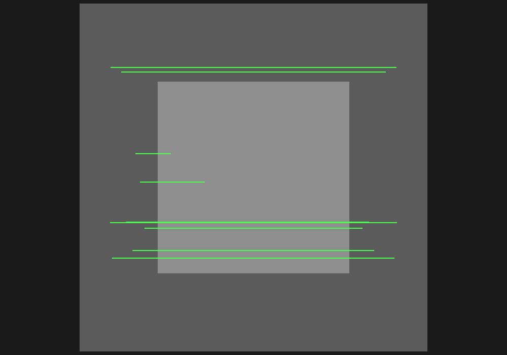
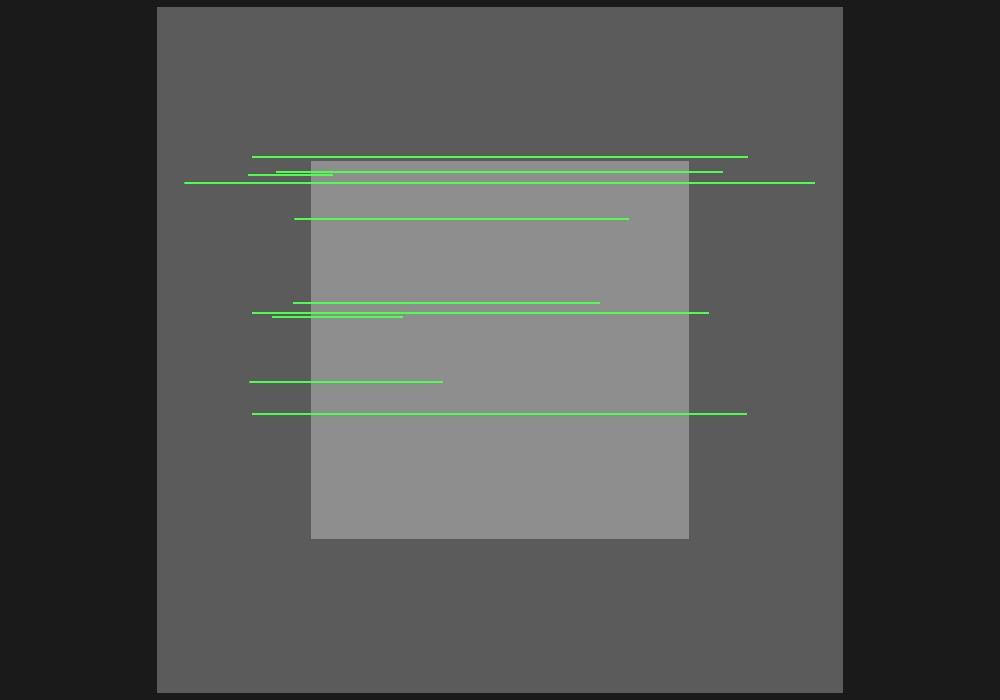
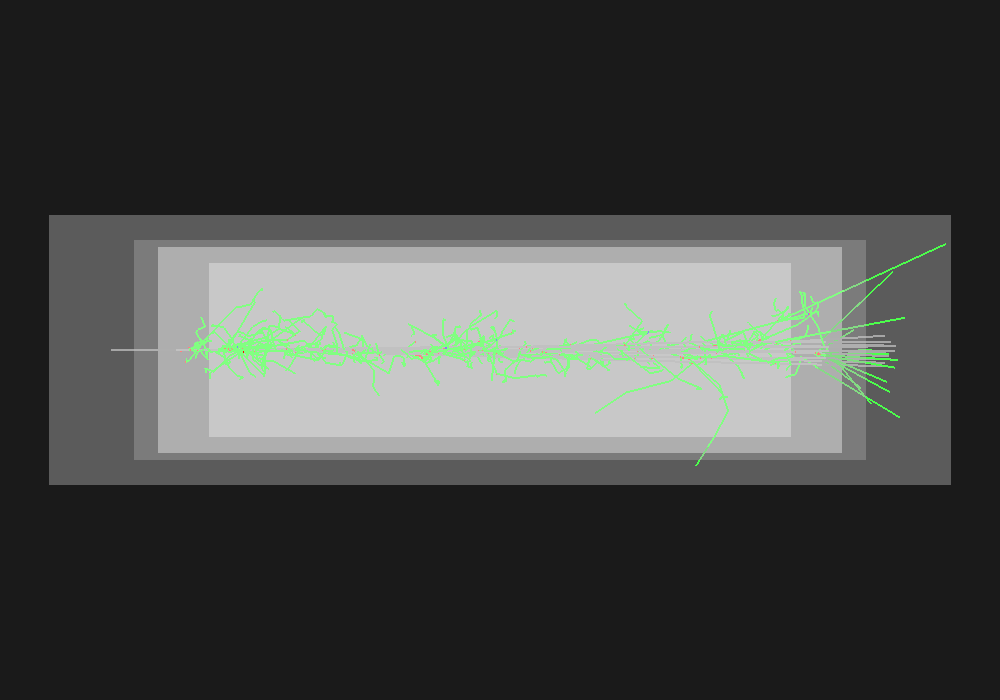

# Curso de transporte de partículas con Geant4

[](https://geant4.web.cern.ch/)
[](https://hub.docker.com/r/rmartinezmaple/geant4-particle-transport-course)
[](#organización)

Este curso estudia cómo una propiedad microscópica termina convertida en un evento Monte Carlo y, después, en una magnitud física. Las prácticas guiadas enseñan el método; los proyectos piden reutilizarlo con menos apoyo.

```text
pregunta física → predicción → visualización → simulación → datos
       → observable → modelo o fit → parámetro físico → comparación → interpretación
```

No necesitas instalar Geant4, CMake ni Python. La imagen Docker contiene **Geant4 11.2.2**, compiladores, datasets, NumPy, SciPy y Matplotlib.

## Organización

El curso actual consta de **dos clases, dos prácticas guiadas y tres proyectos de aplicación**.

### Clase 1 — De la sección eficaz al evento Monte Carlo

La [guía completa de la Clase 1](docs/classes/class01_transport.md) explica cómo Geant4 convierte secciones eficaces en distancias de interacción y estados finales.

Prácticas guiadas:

- **Compton 1A:** transmisión, camino libre medio y sección eficaz.
- **Compton 1B:** cinemática del estado final.

El estudiante trabaja con la [hoja de la Clase 1](worksheets/class01.md) y observa el WRL antes de inspeccionar los datos.

### Clase 2 — Del evento Monte Carlo al observable físico

[Material en preparación](docs/classes/class02_analysis.md). Esta clase desarrollará análisis estadístico, incertidumbres, likelihood, fits, residuos y recuperación de parámetros físicos a partir de 1A y 1B.

Después de aprender ese método, se aplicará en:

- [Proyecto A — Multiple Coulomb Scattering de muones](docs/projects/projectA_mcs.md).
- [Proyecto B — Pérdida de energía de muones en agua](docs/projects/projectB_energy_loss.md).
- [Proyecto C — Sección eficaz de fisión en U-235](docs/projects/projectC_fission.md).

Estos fundamentos pueden utilizarse posteriormente en aplicaciones de detectores construidas sobre Geant4.

## Ruta de trabajo

### Antes de Clase 1

Solo necesitas Git y Docker:

```bash
git clone https://github.com/rmartinezra/geant4-particle-transport-course.git
cd geant4-particle-transport-course

docker pull rmartinezmaple/geant4-particle-transport-course:11.2.2
docker compose run --rm geant4-course make env-check
```

`env-check` verifica versiones, dependencias, datasets, escritura, compilación de los módulos Compton y una escena VRML temporal. No ejecuta barridos científicos, análisis ni fits.

### Durante Clase 1

```bash
docker compose run --rm geant4-course make run-ex1a FAST=1
docker compose run --rm geant4-course make run-ex1b FAST=1
```

Cada comando compila si hace falta, produce un WRL corto y ejecuta el barrido FAST. La [guía de la clase](docs/classes/class01_transport.md) indica qué predecir, observar y calcular; todavía no se ejecuta el análisis completo.

### Durante Clase 2

El flujo de análisis se desarrollará posteriormente. Los scripts existentes se conservan, pero no forman parte de la preparación de la Clase 1.

### No ejecutar todavía

Si quieres evitar spoilers antes de la clase, no ejecutes `make test`, `make all`, `make all FULL=1`, targets `analyze-*` ni consultes los resultados FULL.

## Primero, observa las simulaciones

Estas capturas proceden de WRL reales generados por Geant4 con `VRML2FILE`. Cada escena contiene geometría y trayectorias de diez eventos; no son dibujos esquemáticos.

### Prácticas guiadas · Efecto Compton

| Transmisión gamma en aluminio | Cinemática Compton |
|:---:|:---:|
|  |  |
| Permite distinguir transmisión sin interacción y dispersión. | Relaciona ángulo, fotón dispersado y electrón de retroceso. |

### Proyectos A y B · Transporte de muones

| Dispersión múltiple en hierro | Pérdida de energía en agua |
|:---:|:---:|
|  |  |
| El haz se ensancha al atravesar el hierro. | El muón atraviesa el agua y puede producir secundarios. |

### Proyecto C · Fisión de U-235


La configuración visual favorece observar fisiones con pocos eventos sin introducir biasing en la física.

Los archivos `.wrl` propios quedan en `generated/visualization/`. El visor recomendado es **[Castle Model Viewer](https://castle-engine.io/castle-model-viewer)**, sucesor actual de `view3dscene`.

En Windows con WSL, prepáralo una sola vez y abre la primera escena así, siempre **fuera del contenedor**:

```bash
./scripts/setup_castle_viewer_windows.sh
./scripts/open_wrl_castle.sh \
  generated/visualization/ex1a/compton_transmission_10events.wrl
```

Castle se ejecuta como aplicación nativa de Windows, por lo que no depende de que WSLg muestre correctamente una ventana Linux. La [guía de visualización](docs/visualization.md) explica la instalación manual, los controles y la solución de problemas.

## Qué magnitudes aparecerán

Los siguientes órdenes de magnitud sirven únicamente para orientar unidades y escalas; no sustituyen la predicción ni el resultado obtenido por cada estudiante.

| Actividad | Magnitud orientativa |
|---|---:|
| Compton 1A | sección eficaz de aproximadamente $4.5\ \text{barn/átomo}$ |
| Compton 1B | energía de reposo del electrón de aproximadamente $511\ \mathrm{keV}$ |
| Proyecto A | exponentes de espesor y momento de aproximadamente $0.5$ y $1$ |
| Proyecto B | pérdida específica de aproximadamente $2.3\ \mathrm{MeV}/\mathrm{cm}$ |
| Proyecto C | sección eficaz de aproximadamente $70\ \text{barn/átomo}$ |

[Resultados FULL de referencia — contiene spoilers](docs/expected_results.md). Las cifras precisas y la galería completa de fits están deliberadamente fuera de esta página.

## Salidas y comandos

Los resultados se conservan en el checkout aunque se elimine el contenedor:

```text
generated/
├── data/           # eventos y barridos Monte Carlo
├── figures/        # gráficas producidas por el análisis
├── fits/           # parámetros e incertidumbres
├── logs/           # macros, seeds y salida de Geant4
└── visualization/  # geometría y trayectorias en archivos .wrl
```

| Objetivo | Comando dentro de Docker |
|---|---|
| Comprobar el entorno de Clase 1 | `make env-check` |
| Ver la ruta de Clase 1 sin ejecutarla | `make class01-help` |
| Ver todas las opciones | `make help` |
| Ejecutar una práctica FAST | `make run-ex1a FAST=1` |
| Crear solo su WRL | `make visualize-ex1a` |
| Analizar más adelante | `make analyze-ex1a` |
| Validar el repositorio completo más adelante | `make test` |
| Borrar resultados generados | `make clean-generated` |

Cambia `ex1a` por `ex1b`, `ex2`, `ex3` o `ex4` según la actividad. `FAST=1` reduce la estadística sin cambiar la física; `FULL=1` ejecuta la producción de referencia y puede tardar bastante; `VIS=0` omite explícitamente el WRL automático.

## Construcción local opcional

El flujo normal usa `docker pull`. Para auditar el Dockerfile o modificar la imagen:

```bash
docker compose -f compose.yaml -f compose.build.yaml build
docker compose run --rm geant4-course geant4-config --version
```

El Dockerfile fija el código fuente y los checksums de Geant4 11.2.2 y sus datasets. La [guía Docker](docs/docker_quickstart.md) contiene detalles de persistencia, permisos y solución de problemas.

## Mapa de documentación

- [Visión general y orden sugerido](docs/course_overview.md)
- [Clase 1: de la sección eficaz al evento Monte Carlo](docs/classes/class01_transport.md)
- [Hoja de trabajo de la Clase 1](worksheets/class01.md)
- [Inicio rápido y solución de problemas Docker](docs/docker_quickstart.md)
- [Notas físicas y decisiones de análisis](docs/physics_notes.md)
- [Abrir archivos VRML y estudiar trayectorias con Castle](docs/visualization.md)
- [Resultados FULL de referencia — contiene spoilers](docs/expected_results.md)

Los CSV, WRL, logs, builds y datasets generados están ignorados por Git. El código derivado conserva los avisos aplicables de Geant4; consulta [LICENSE](LICENSE) y [CITATION.cff](CITATION.cff).
