# Resultados esperados

> **SPOILERS — resultados FULL de referencia.** Consulta esta página solo después de formular tus predicciones, inspeccionar los WRL y obtener tus propios observables. Las cifras y curvas siguientes revelan las respuestas de los ejercicios.

Los valores siguientes corresponden a Geant4 11.2.2. Deben reproducirse dentro de las tolerancias, no bit a bit: las seeds, el paralelismo y el tamaño de muestra producen variaciones estadísticas.

| Módulo | Magnitud FULL | Resultado Monte Carlo |
|---|---|---:|
| Compton A | $\mu$ | $0.274090\pm 0.000611\ \mathrm{cm}^{-1}$ |
| Compton A | $\lambda$ | $3.64843\pm 0.00813\ \mathrm{cm}$ |
| Compton A | $\sigma$ | $4.54995\pm 0.01014\ \text{barn/átomo}$ |
| Compton B | $m_e c^2$, fit lineal | $511.302\pm 0.068\ \mathrm{keV}$ |
| MCS | $\alpha_{\mathrm{thickness}}$ | $0.51350\pm 0.00110$ |
| MCS | $\alpha_{\mathrm{momentum}}$ | $1.03593\pm 0.00482$ |
| Pérdida de energía | $dE/dx$, $\mu^+$ de $3\ \mathrm{GeV}$ en agua | $2.29342\pm 0.0058\ \mathrm{MeV}/\mathrm{cm}$ |
| Fisión U-235 | $\lambda$, neutrón de $1\ \mathrm{eV}$ | $0.294824\pm 0.001032\ \mathrm{cm}$ |
| Fisión U-235 | $\sigma_{\mathrm{fission}}$ | $69.493\pm 0.243\ \text{barn/átomo}$ |

Tolerancias FAST automáticas: masa Compton $480$–$540\ \mathrm{keV}$, exponentes MCS $0.3$–$0.7$ y $0.7$–$1.3$, $dE/dx$ $1$–$5\ \mathrm{MeV}/\mathrm{cm}$ y magnitudes hadrónicas positivas. FULL debe dar incertidumbres menores y acuerdo más estrecho con las referencias posteriores.

Las corridas FULL usaron 100 000 eventos por punto para Compton A, MCS, pérdida de energía y fisión, y 200 000 eventos para Compton B. Las referencias internas se consultaron después de medir: $4.55532\ \text{barn/átomo}$ en Compton A, $510.99895\ \mathrm{keV}$ para la energía de reposo del electrón, $2.30\ \mathrm{MeV}/\mathrm{cm}$ con `G4EmCalculator` y $69.64\ \text{barn/átomo}$ para `nFission`. No se usan como restricciones de los ajustes.

Las gráficas publicadas en `examples/expected_results/` proceden de esas corridas FULL; no se incluyen sus CSV fuente. En pérdida de energía, las barras de `dedx_vs_energy.png` son SEM y las distribuciones conservan las colas radiativas.

## Galería completa de resultados y fits

### Prácticas guiadas 1A y 1B

| Transmisión frente al espesor | Energía frente al ángulo |
|:---:|:---:|
| 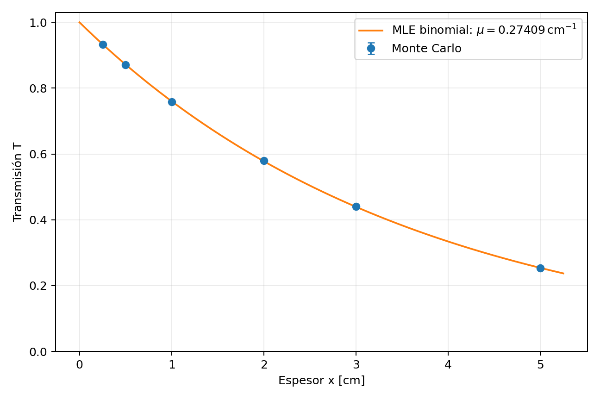 | 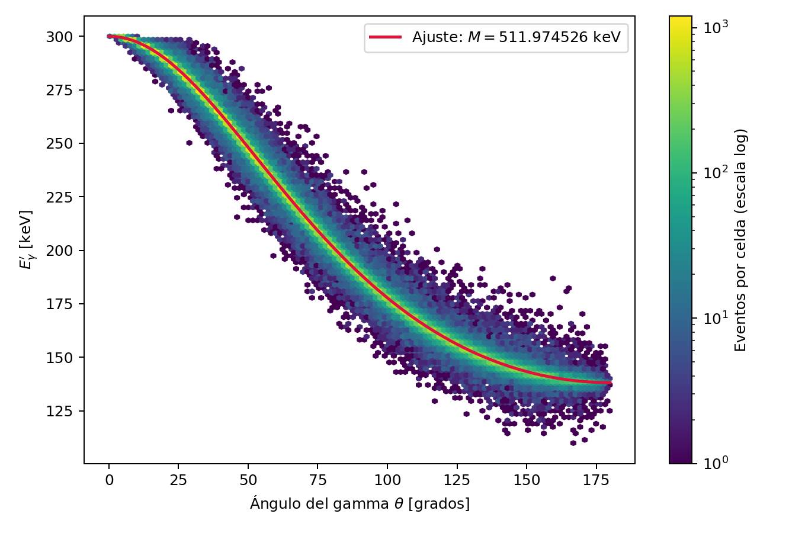 |

| Linealización de Compton | Distribución angular |
|:---:|:---:|
| 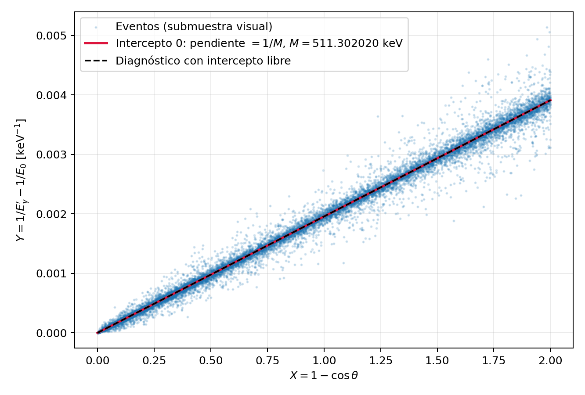 | 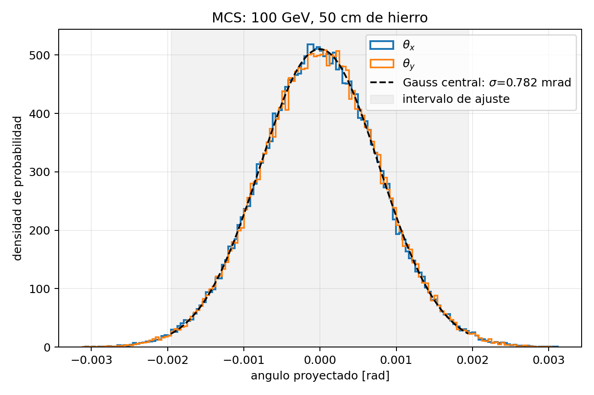 |

### Proyecto A — Dispersión múltiple

| Escala con el espesor | Escala con el momento |
|:---:|:---:|
| 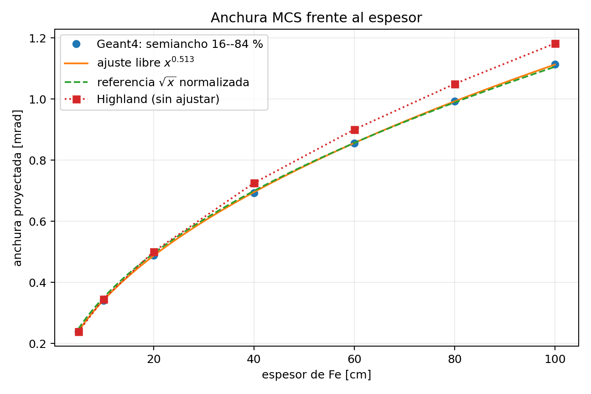 | 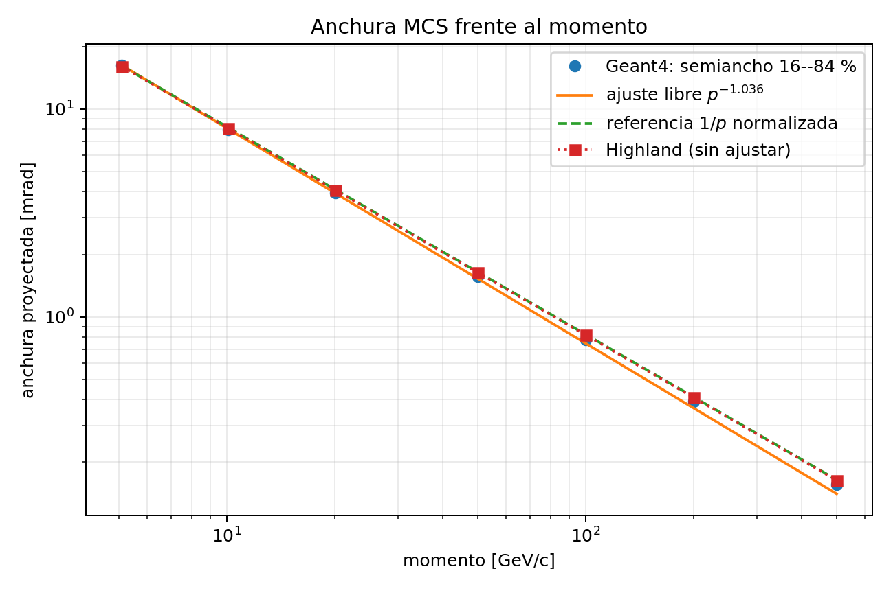 |

### Proyecto B — Pérdida de energía

| Distribución por evento | Pérdida media frente al espesor |
|:---:|:---:|
| 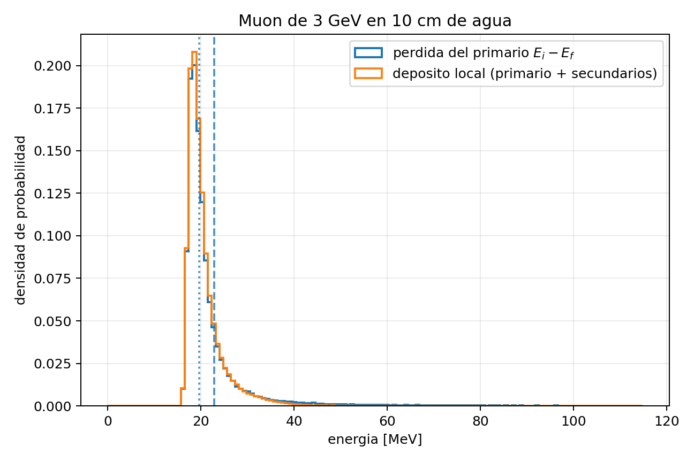 | 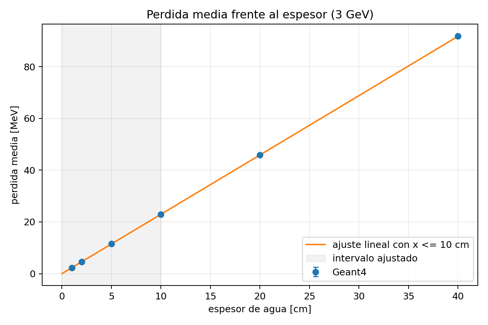 |

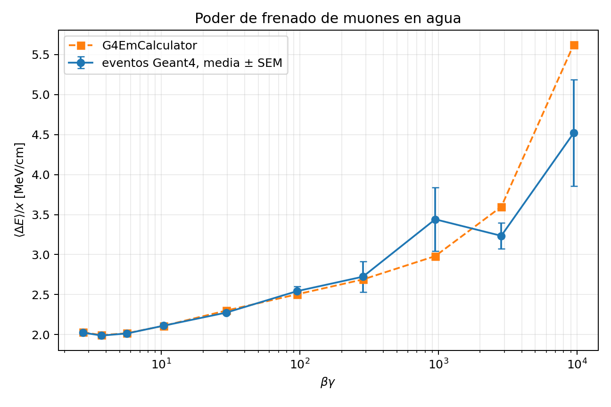

### Proyecto C — Fisión

| Primera distancia de fisión | Supervivencia con censura derecha |
|:---:|:---:|
| 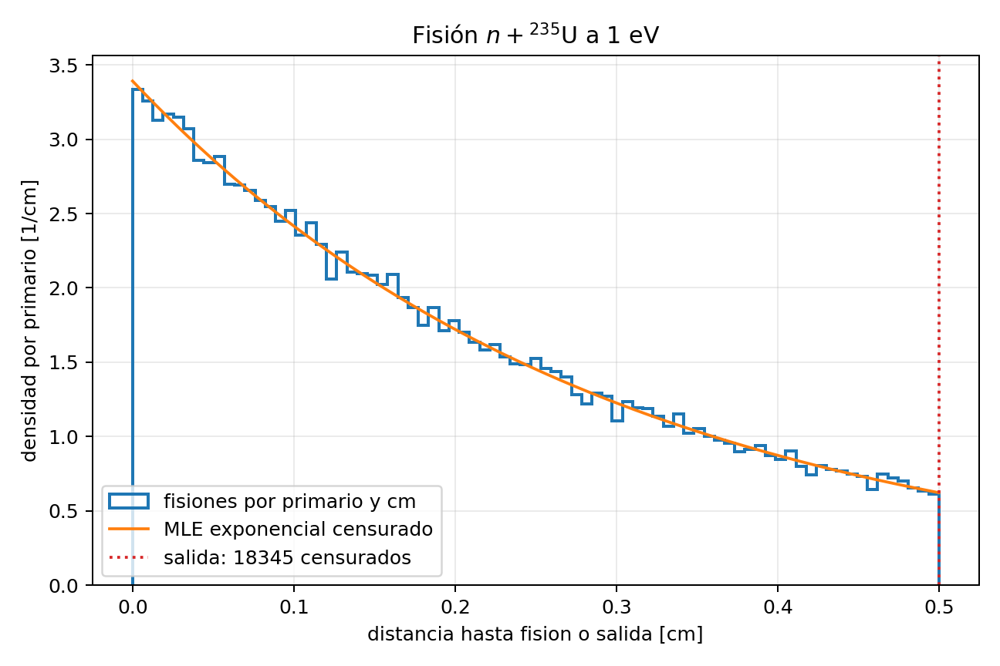 | 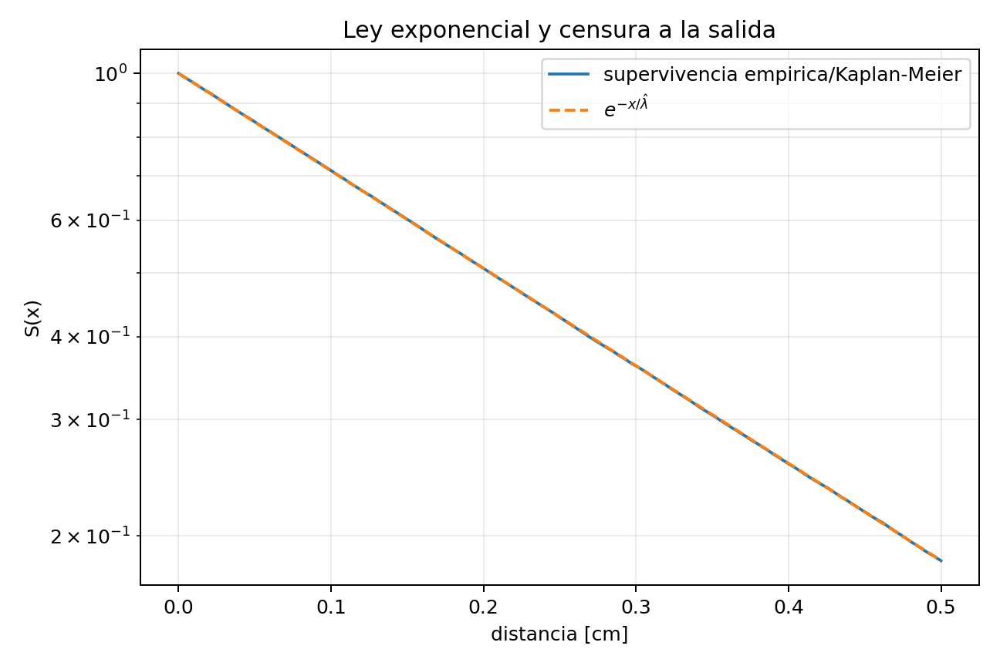 |

Vuelve a la [orientación del curso](../README.md) para continuar con la ruta docente.
