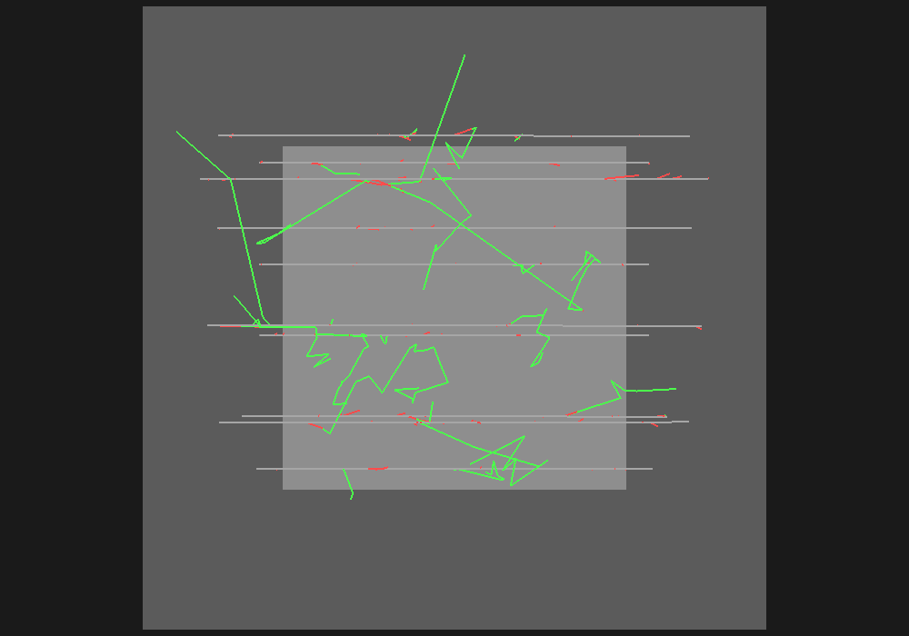

# Proyecto B — Pérdida de energía de muones en agua

**Pregunta central:** ¿cómo se relacionan la pérdida de energía del primario, el depósito local y la energía transportada por secundarios?

Usa esta guía durante la clase y completa la [hoja del Proyecto B](../../worksheets/projects/projectB.md). Los [resultados FULL de referencia](../expected_results.md) contienen spoilers y se consultan únicamente al final.

## Qué vas a simular

| Elemento | Configuración de producción |
|---|---|
| Partícula primaria | Muón positivo, `mu+` |
| Material físico | Agua, material NIST `G4_WATER` |
| Física | Física electromagnética estándar de TestEm18, deliberadamente sin dispersión múltiple |
| Barrido de espesor | 1, 2, 5, 10, 20 y 40 cm a 3 GeV |
| Barrido de energía | 0.2 a 1000 GeV en diez puntos, usando 1 cm de agua |
| Muestra representativa | 3 GeV y 10 cm, con secundarios transportados |

La ausencia intencional de dispersión múltiple aísla la pregunta energética. No es una afirmación de que un muón real no se disperse en agua.

En los barridos, los secundarios se eliminan después de registrar la energía con la que nacen; la pérdida de energía del primario permanece completa. En la muestra representativa sí se transportan, de modo que puede compararse energía transferida con depósito local dentro del volumen finito.

## Antes de ejecutar

Predice y registra:

1. si la pérdida media crecerá linealmente con espesores delgados;
2. si media y mediana coincidirán en una distribución con colas radiativas;
3. cuándo `energy_loss_MeV` y `energy_deposited_MeV` pueden diferir;
4. cómo esperas que cambie $dE/dx$ con la energía del muón.

## 1. Generar y observar la simulación

```bash
docker compose run --rm geant4-course make visualize-ex3
./scripts/open_wrl_castle.sh \
  generated/visualization/ex3/muon_energy_loss_10events.wrl
```

El WRL usa 10 muones de 3 GeV atravesando 100 cm de agua y transporta los secundarios. Esa longitud visual facilita reconocer interacciones; los barridos científicos usan las longitudes de la tabla anterior.



En Castle identifica el volumen de agua, el primario, los puntos donde aparecen secundarios y las trayectorias que abandonan el volumen. La escena muestra eventos individuales, pero no permite estimar por sí sola una pérdida media.

## 2. Correr los datos de clase

```bash
docker compose run --rm geant4-course \
  make run-ex3 FAST=1 VIS=0 SEED=20260901
```

La muestra FAST contiene 300 eventos por configuración y 300 eventos representativos. El target sobrescribe `generated/data/ex3/`. Para mejorar posteriormente la estadística usa `FULL=1`, que ejecuta 100 000 eventos por configuración y requiere más tiempo.

## 3. Auditar los datos

```bash
head generated/data/ex3/thickness_scan.csv
head generated/data/ex3/dedx_energy_scan.csv
head generated/data/ex3/energy_loss_events.csv
head generated/data/ex3/process_contributions.csv
```

| Archivo | Qué representa una fila |
|---|---|
| `thickness_scan.csv` | Resumen de eventos para un espesor a 3 GeV |
| `dedx_energy_scan.csv` | Resumen para una energía en 1 cm de agua |
| `energy_scan.csv` | Alias con el mismo barrido energético enriquecido |
| `energy_loss_events.csv` | Un evento de la muestra de 3 GeV y 10 cm |
| `process_contributions.csv` | Contribuciones medias por proceso y energía |
| `run_metadata.json` | Física, políticas de secundarios, seed y corridas |

En la muestra por evento comprueba:

$$
\Delta E_{\mathrm{primario}}=E_{\mathrm{inicial}}-E_{\mathrm{final}}.
$$

No impongas que toda esa energía se deposite localmente: un secundario puede transportar energía fuera del agua. Compara media, SEM, mediana y cuantiles antes de describir la distribución.

## 4. Analizar y ver las figuras

```bash
docker compose run --rm geant4-course make analyze-ex3
```

Revisa:

```text
generated/figures/ex3/energy_loss_distribution.png
generated/figures/ex3/mean_energy_loss_vs_thickness.png
generated/figures/ex3/dedx_vs_energy.png
generated/figures/ex3/process_contributions_vs_energy.png
generated/fits/ex3/summary_energy_loss.txt
```

La pendiente de la pérdida media frente al espesor delgado permite estimar $dE/dx$. El barrido energético muestra el poder de frenado y sus barras de error representan el error estándar de la media. La consulta a `G4EmCalculator` es una comparación posterior, no un dato usado para ajustar la simulación.

Pregunta al leer las figuras:

- ¿la distribución es simétrica o tiene una cola de pérdidas grandes?;
- ¿la media frente al espesor conserva una región aproximadamente lineal?;
- ¿cómo cambia la incertidumbre de la media cuando aparecen eventos raros?;
- ¿qué procesos dominan en regiones de energía distintas?

## Evidencia para entregar

- captura del WRL con primario, material y al menos un secundario señalados;
- seed, modo y commit;
- comprobación del balance por evento;
- comparación de media, mediana, cuantiles y SEM;
- valor inferido de $dE/dx$ con unidades e incertidumbre;
- explicación de por qué pérdida del primario, transferencia a secundarios y depósito local no son sinónimos.

Consulta también el [README técnico del ejercicio](../../exercises/03_energy_loss/README.md).
